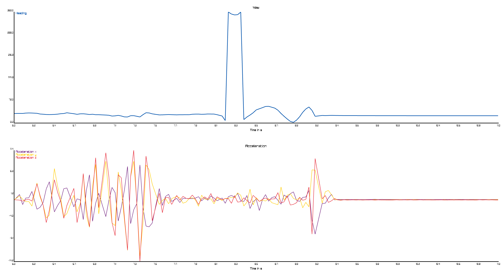
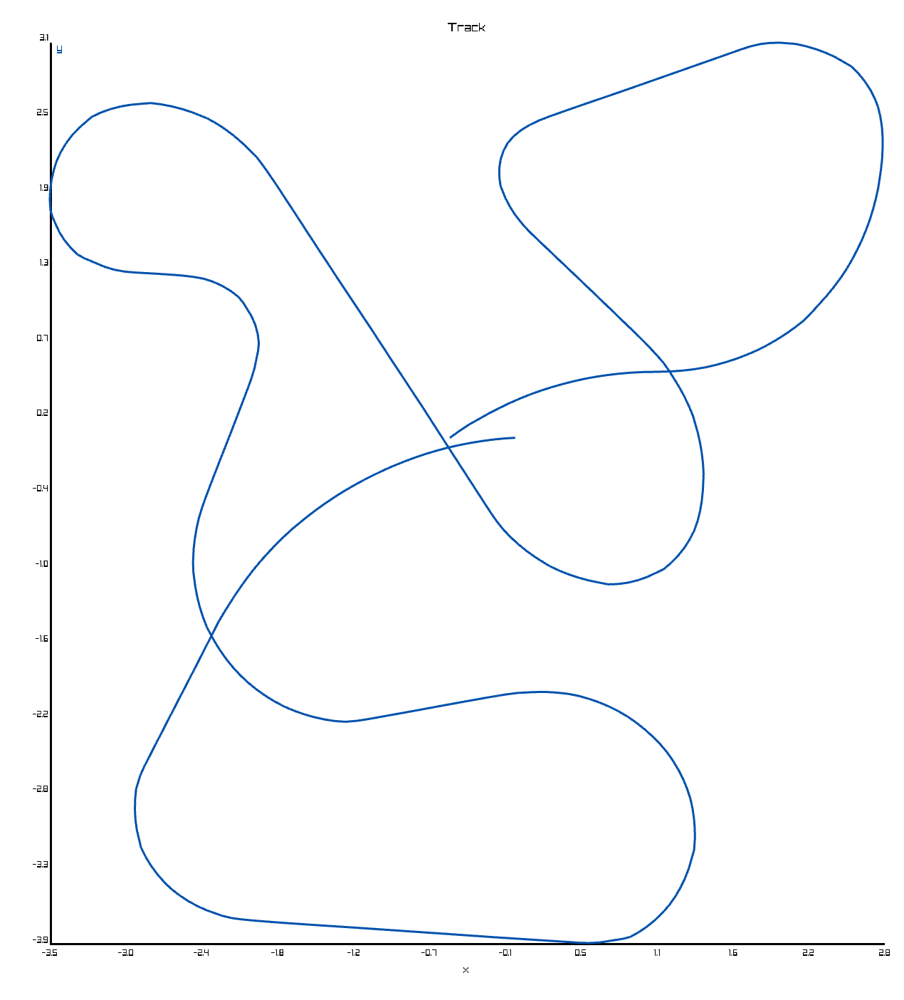

# ASC - Autonomous Slot Car

An autonomous slot-car (something like carrera) running on a Raspberry Pi.
It also provides a cross-platform client application that will be able to send commands and is able to plot measurements.

Measurements made by the IMU

A reconstruction of a [slot-car track](https://www.srcp3.de/)

## Quickstart

This Quickstart enables you to build project.

### Setup the Raspberry Pi

First install `Raspberry Pi Os Lite 64-bit` and configure WLAN and use ssh public key authentication.
Then update the system with `apt update && apt upgrade`.
Deactivate the serial console but leave the serial hardware on (`raspi-config` under Interface Options).

### Setup the project

Zig has to be installed.  
Clone this repository with submodules: `git clone --recurse-submodules https://github.com/AndreasMuehlmann/asc.git`  
Copy the pigpio library and header to your project (in your project root):

    mkdir lib/pigpio  
    scp <raspberryUser>@<raspberryAddressOrHostname>:/usr/include/pigpio.h lib/pigpio  
    scp <raspberryUser>@<raspberryAddressOrHostname>:/usr/lib/libpigpio.so.* lib/pigpio  

At this point you should be able to build the project with `zig build`. But when you run the controller executable you will get an error because the bno055 is not connected yet.
To deploy the project to your raspberry pi you can use `zig build deploy`. Then you can run the controller executable for example with an ssh console.
To run the client you can use `zig build runClient`.
  

### Setup the Bno055

Just connect the bno055 via UART and enable the UART mode of the bno055 by setting PS1 to high.
The Bno055 will probably not be used in the future so there is no more detailed description here.

### Power the Raspberry Pi

TODO

## Controller

Vision:  
- Measuring the rotation of the front wheels and estimating the driven distance
- Measuring the rotation of the car with an IMU
- Measuring the rotation of the slot with an IMU
- Drive around the track slowly and collect measurement data. This way the controller knows how the track looks
- Estimate where the car is on the track with the driven distance and by using iterative closest point on the rotation measurement of the slot
- Use a PD-Controller to control the speed of the car
- Make a speed estimate for sections of the track
- Drive faster until acceleration or sliding is too big
- Split the track in more sections
- Detect if the car is off the track by checking for contact to the conductor on the track

## Client

The client can already:
- plot acceleration
- plot heading

Vision:
- Send commands to the controller, also commands with response
- Making a map of the track and showing where the car thinks it is
- Other telemetry data like battery life

## TODO

- log messages from server to client
- Answer getters for config
- Track on client and controller
- Filter and other positioningTest stuff to main prog

- Console ctrl c, ctrl v
- Measure voltage
- Store Config in persistent memory
- Sending messages with arbitrary size (to for exmaple send the whole track back to the controlleer)
- Add point after every milimeter

- Go to track after fixing distance measurement
- Positioning
- Collect data in user drive
- try to fit model in positioningTest

- Use Vec2D every where

- Controller: Endmapping fails
- Controller: Not only sending commands from client to sever but also from server to client to for example reset the track map
- Client: Console with more features for example arrow up and ctrl backspace, better cursor.
- Client: Output from command parser or responses from server or previous commands displayed in the console.
- Controller: Responses from server to client when client sends commands that lead to an error.

- Fix distance calculation
- not necessarily, needs more research: new pcb with c6 instead of c3

- write documentation
- Dont know if this is still a thing: Fix error in command parser for quoted strings?? Not sure if this is even a problem

### Visualize kdtree with graphviz

run program containing `kdtree.print()` and pipe output into `graph.dot`.
`dot -Tsvg graph.dot > graph.svg`

